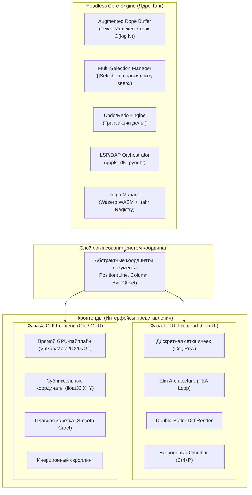
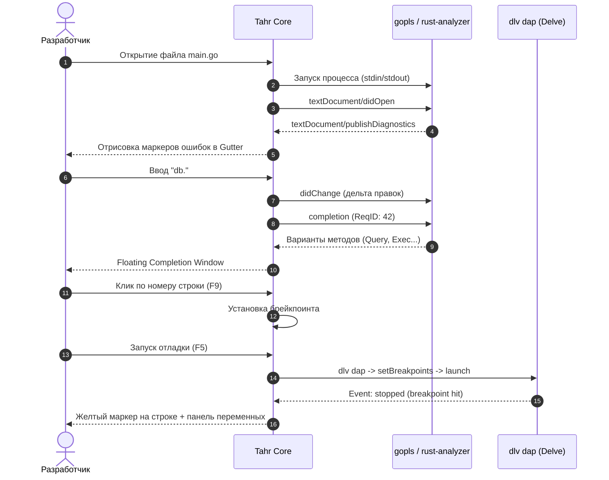

# Архитектурная и техническая спецификация Tahr: Dual-Target IDE (TUI ➔ GUI)

> **Tahr** — быстрая, современная модульная IDE на языке Go с единым независимым ядром (Headless Core) и двумя целевыми интерфейсами: **изначально терминальным (TUI на GoatUI)** с последующим подключением **нативного графического окна (GUI на Gio)**.

---

## 1. Концепция, миссия и философия проекта

### 1.1. Главная идея: Дуальная IDE (Dual-Target)
Вместо того чтобы выбирать между консолью и окном, Tahr строится как **двухрежимная система**:
1. **Изначальный этап (TUI-First на GoatUI):** 
   Создание первоклассной терминальной IDE на базе собственного фреймворка [GoatUI](https://github.com/baibeicha/goatui). Это дает быстрый запуск, отсутствие проблем с оконными подсистемами ОС на старте, моментальную применимость на серверах по SSH и быстрый выход на режим *Dogfooding* (разработка Tahr внутри самого Tahr).
2. **Стратегический этап (GUI на Gio):** 
   Подключение полноценного нативного графического интерфейса на базе векторного GPU-фреймворка [Gio](https://gioui.org). Тот же самый движок буфера, LSP, отладчика и плагинов начинает рендериться на GPU (Vulkan / Metal / DirectX 11 / OpenGL) со сглаженной анимацией каретки (Smooth Caret), пропорциональными шрифтами и плавной инерционной прокруткой.

### 1.2. Философия управления: Отказ от модального барьера
В отличие от Neovim или Helix, Tahr **не заставляет пользователя учить модальные режимы** (Normal / Insert / Visual / Command). 
* Управление строится на привычных, эргономичных стандартах современных редакторов (`Ctrl+S`, `Ctrl+P`, `Ctrl+F`, `Ctrl+C`, `Ctrl+V`, стрелки, выделение через `Shift` и клики мыши).
* Встроенная палитра команд (Omnibar) дает мгновенный доступ к любым действиям без необходимости запоминать сотни комбинаций.

### 1.3. Сборка и распространение (Build Tags)
Благодаря системе тегов сборки Go, проект компилируется в двух вариантах:
* `go build -tags "!gui"` $\to$ ультралегкий бинарник (15–20 МБ) только с TUI-интерфейсом. Идеально для серверов, контейнеров и удаленной работы по SSH.
* `go build -tags "gui"` $\to$ десктопный бинарник с поддержкой обоих режимов:
  ```bash
  tahr main.go        # Запуск в текущем терминале через GoatUI
  tahr --gui main.go  # Запуск в нативном графическом окне через Gio
  ```

---

## 2. Архитектура: Паттерн Headless Core

Ключевой архитектурный принцип Tahr — **полная изоляция движка редактора от экрана**. 
Ядро ничего не знает о пикселях, шрифтах, терминальных escape-последовательностях или клетках экрана. Оно оперирует только абстрактным пространством документа.



### Разделение систем координат: Клетки vs Пиксели
* **Ядро (Core):** Оперирует структурой `Position`:
  ```go
  type Position struct {
      Line   int // 0-based номер строки
      Column int // Смещение в рунах / визуальных знакоместах
      Byte   int // Абсолютный байтовый офсет в буфере
  }
  ```
* **GoatUI (TUI):** Преобразует срез видимых строк в ячейки матрицы терминала `Cell{Char, FgColor, BgColor}` с атрибутами TrueColor.
* **Gio (GUI):** Преобразует те же токены в вызовы растеризатора глифов с субпиксельными смещениями `(float32 X, float32 Y)`, сглаживанием текста и отрисовкой плавной каретки.

---

## 3. Рекомендуемая структура кодовой базы

Проект разделен на слабосвязанные модули, исключающие циклические зависимости:

```text
tahr/
├── cmd/
│   └── tahr/
│       ├── main.go            # Точка входа, разбор CLI-флагов (--gui)
│       ├── app_tui.go         # Инициализация GoatUI (при //go:build !gui)
│       └── app_gui.go         # Инициализация Gio (при //go:build gui)
├── internal/
│   ├── core/                  # Headless ядро редактора
│   │   ├── engine.go          # Координатор буферов, окон и событий
│   │   ├── buffer/            # Работа с текстом
│   │   │   ├── rope.go        # Дополненный Rope с индексами строк
│   │   │   ├── selection.go   # Мультикурсоры и выделение
│   │   │   ├── history.go     # Транзакционный Undo/Redo стек
│   │   │   └── utf.go         # Преобразования UTF-8 / UTF-16 / Runes
│   │   ├── lsp/               # Клиент протокола языковых серверов
│   │   │   ├── client.go      # JSON-RPC 2.0 клиент над os/exec
│   │   │   ├── protocol.go    # Типы LSP 3.17+
│   │   │   └── sync.go        # Инкрементальная синхронизация дельт
│   │   ├── dap/               # Клиент Debug Adapter Protocol (отладка)
│   │   │   ├── client.go      # Запуск dlv dap / debugpy
│   │   │   └── session.go     # Брейкпоинты, стек вызовов, переменные
│   │   ├── syntax/            # Подсветка синтаксиса (Tree-sitter)
│   │   │   ├── treesitter.go  # Интеграция с CGO / WASM парсерами
│   │   │   └── highlighter.go # Сопоставление AST и highlights.scm
│   │   └── plugin/            # Менеджер расширений
│   │       ├── manager.go     # Поиск, распаковка .tahr и загрузка
│   │       ├── manifest.go    # Парсер plugin.json
│   │       ├── wasm_host.go   # Wazero рантайм и экспорт Host API
│   │       └── installer.go   # Распаковка Zstandard архивов
│   └── ui/                    # Слой представления (Frontends)
│       ├── types.go           # Общие интерфейсы UI (View-модели, цвета)
│       ├── tui/               # Фронтенд на GoatUI
│       │   ├── app.go         # Главная TEA-модель (Elm Architecture)
│       │   ├── view_editor.go # Отрисовка буфера, номеров строк, Gutter
│       │   ├── view_popup.go  # Попап автодополнения и документации
│       │   └── view_status.go # Статусная строка и диагностика
│       └── gui/               # Фронтенд на Gio (GPU)
│           ├── window.go      # Инициализация окна и GPU-пайплайна
│           ├── layout.go      # Immediate-mode лейаут редактора
│           └── render.go      # Отрисовка шрифтов, Smooth Caret, скролл
├── pkg/
│   └── tahr_sdk/              # SDK для авторов плагинов (Go/WASM)
├── go.mod
└── go.sum
```

---

## 4. Фундамент работы с текстом: Алгоритмы и структуры данных

### 4.1. Дополненный Rope (Augmented Rope)
Для обеспечения скорости при открытии файлов любого размера (вплоть до сотен мегабайт) используется Rope с балансировкой (на базе `github.com/zyedidia/generic/rope`), расширенный метаданными в каждом узле:
* `ByteLength int` — длина текста в поддереве в байтах.
* `LineCount int` — количество символов `\n` в поддереве.
* **Следствие:** Любой прыжок на строку №N (`Ctrl+G` или клик по ошибке LSP) выполняется за **$O(\log N)$ шагов** по дереву, исключая линейный перебор байт.

### 4.2. Модель курсоров: Multi-Selection First
В ядре нет понятия «одиночный курсор». Всегда хранится срез `Selections []Selection`:
```go
type Selection struct {
    Anchor Position // Начало диапазона
    Head   Position // Каретка (курсор)
}
```
* **Одиночный курсор:** `len(Selections) == 1` при `Anchor == Head`.
* **Мультикурсоры (`Ctrl+D`, `Alt+Click`):** `len(Selections) > 1`.
* **Железное правило:** Применение правок от нескольких курсоров **всегда выполняется снизу вверх** (от большего байтового смещения к меньшему), чтобы изменение текста не сдвигало координаты курсоров, находящихся выше.

### 4.3. Триада кодировок: UTF-8 $\leftrightarrow$ UTF-16 $\leftrightarrow$ Двойная ширина ячеек
* Go хранит текст в **UTF-8**.
* LSP считает координаты `character` в **UTF-16 code units** (1 русская буква = 1 unit, эмодзи = 2 units — суррогатная пара).
* GoatUI отображает символы в терминальной сетке, где CJK-иероглифы и эмодзи занимают **2 знакоместа**.
* Вся математика курсора опирается на библиотеку [mattn/go-runewidth](https://github.com/mattn/go-runewidth), предотвращая рассинхрон каретки и разрывы строк.
* При загрузке файлы с `\r\n` нормализуются в `\n` для консистентности индексов, а при сохранении восстанавливается исходный формат.

### 4.4. История правок (Undo/Redo) и безопасное сохранение
* **Паттерн Command на дельтах:** Сохраняются только обратимые примитивы (`Insert`/`Delete`), последовательный набор символов одного слова склеивается в одну транзакцию. Память не забивается копиями буфера, минимизируя паузы сборщика мусора (GC).
* **Safe Atomic Save:** Запись в `.{file}.tahr.tmp` $\to$ `file.Sync()` $\to$ `os.Rename`. Код пользователя физически невозможно повредить при внезапном сбое питания.

---

## 5. Защита терминального слоя (GoatUI Hardening)

Для работы TUI-режима на уровне современных стандартов в GoatUI закладываются:
1. **Bracketed Paste Mode (`\x1b[?2004h`):** Вставка 1000 строк кода из буфера обмена передается атомарно без ступенчатой «лесенки» от автоотступов.
2. **SGR-1006 Mouse Mode (`\x1b[?1006h`):** Снятие старого терминального лимита в 223 колонки; клики и скроллинг колесиком работают на 4K-мониторах во весь экран.
3. **Kitty Keyboard Protocol:** Различение `Tab` и `Ctrl+I`, перехват `Shift+Enter`, `Ctrl+Enter`.
4. **Таймер задержки Escape (25–35 мс):** Отделение нажатия клавиши `Esc` от начала escape-последовательностей стрелок и Alt-комбинаций.

---

## 6. Языковой интеллект: LSP и DAP

Tahr работает как надежный и производительный оркестратор внешних протоколов.



### 6.1. Защита от утечек и зомби-процессов
* **Linux:** `prctl(PR_SET_PDEATHSIG, SIGTERM)` — автоматическое уничтожение языковых серверов при падении Tahr.
* **Windows:** Привязка дочерних процессов к `Job Object` с флагом `JOB_OBJECT_LIMIT_KILL_ON_JOB_CLOSE`.

### 6.2. Инкрементальная синхронизация и подавление гонок
* Обмен изменениями идет строго через `TextDocumentSyncKind.Incremental` (только измененный диапазон текста).
* Управление запросами автодополнения: при быстром вводе текста старые невыполненные запросы отменяются через `$/cancelRequest`, а устаревшие ответы отсекаются по монотонному `RequestID`.

---

## 7. Архитектура пакетов `.tahr` и плагинов

### 7.1. Пакет `.tahr` (ZIP с компрессией Zstandard)
Пакет плагина представляет собой компактный архив `.tahr`, сжатый современным алгоритмом **Zstandard** с помощью высокопроизводительной библиотеки [klauspost/compress/zip](https://github.com/klauspost/compress).
* Сжатие превосходит стандартный ZIP/Deflate.
* Скорость распаковки с использованием векторных инструкций SIMD (AVX2/NEON) достигает **1.5–2 ГБ/сек на ядро процессора**.

### 7.2. Модель «Распаковка при установке» (VS Code Way)
1. Пользователь запускает команду:
   ```bash
   tahr plugin install python.tahr
   # или из удаленного реестра:
   tahr plugin install rust
   ```
2. Tahr проверяет манифест `plugin.json`, защищает пути от Zip Slip атак и распаковывает архив в `~/.config/tahr/plugins/<plugin-id>/`.
3. **Почему распаковка необходима:**
   * Ядро ОС не может запустить процесс (LSP-сервер или отладчик) изнутри архива.
   * Нативная файловая система позволяет ОС кэшировать файлы в Page Cache, обеспечивая запуск Tahr за **5–10 мс**.
   * Разработчики плагинов могут создавать симлинки (`tahr plugin link ./my-dev-plugin`) для мгновенного hot-reload без перепаковки архивов.

### 7.3. Двухуровневая классификация плагинов

#### Уровень 1: Декларативные языковые пакеты (No-Code, 85% языков)
Для большинства языков программирования компилятор плагинов не нужен. Пакет весит **30–50 КБ**:
```text
python.tahr (Zstd ZIP)
├── plugin.json          # Команды запуска pyright, debugpy, расширения
└── queries/
    ├── highlights.scm   # Запросы к AST для цветов подсветки
    └── indents.scm      # Правила автоотступов
```

#### Уровень 2: Исполняемые расширения (Wazero WASM Sandbox)
Для плагинов с кастомной логикой (AI-ассистенты, Git-панели, генераторы кода):
* Плагин пишется на Go (через TinyGo), Rust или Zig и компилируется в `plugin.wasm`.
* Исполняется в чисто-Go рантайме **Wazero** (без CGO) с изоляцией памяти.
* Защита: вызовы ограничены декларативными правами (Capabilities: `fs:read`, `process:exec`) и выполняются с жестким таймаутом (`context.WithTimeout` 250 мс) в фоновых горутинах.

---

## 8. Эволюция интерфейса: От TUI к GUI

### Фаза 1: GoatUI-First (Текущий фокус)
* Работа в терминале через The Elm Architecture (TEA).
* Двойная буферизация с diff-рендерингом: перерисовываются только изменившиеся символы.
* Omnibar (палитра команд и быстрый переход по файлам по `Ctrl+P`).
* Скорость холодного старта: **< 15 мс**.

### Фаза 2: Подключение нативного GUI на Gio (GPU)
Когда ядро полностью отлажено и протестировано в боевых условиях, создается модуль `internal/ui/gui`:
* **Оконная подсистема:** Нативное окно на Gio без веб-технологий (никакого Chromium, Electron или DOM).
* **Рендеринг:** Векторный пайплайн через Vulkan / Metal / DirectX 11 / OpenGL со стабильными 60–120 FPS.
* **Визуальные преимущества перед терминалом:**
  * Субпиксельное позиционирование курсора и плавная анимация перемещения (Smooth Caret).
  * Плавный инерционный скроллинг колесиком мыши и трекпадом.
  * Поддержка пропорциональных шрифтов, шрифтовых лигатур (`!=`, `:=`, `=>`) и плавающих мини-окон с документацией.

---

## 9. Пошаговый план разработки (Roadmap)

```
[ Фаза 1: TUI MVP ] ──► [ Фаза 2: Alpha ] ──► [ Фаза 3: Beta LSP ] ──► [ Фаза 4: Плагины ] ──► [ Фаза 5: Gio GUI ]
   (3-4 недели)            (3-4 недели)            (1-2 месяца)             (1 месяц)              (Будущее)
```

### Фаза 1: Базовый терминальный редактор (MVP)
* Реализация дополненного Rope-буфера с индексацией строк.
* Математика мультикурсоров (`[]Selection`) и навигация стрелками/кликами мыши.
* Вывод через GoatUI: отрисовка видимого окна строк, номеров строк (Gutter) и статус-бара.
* Ввод текста, Backspace, Enter, выделение через `Shift + стрелки`.
* Транзакционный Undo/Redo стек и атомарное сохранение файла (`Ctrl+S`).
* *Результат: надежный быстрый консольный редактор уровня Nano/Micro.*

### Фаза 2: Эргономика, синтаксис и палитра (Alpha)
* Интеграция Omnibar из GoatUI: быстрый поиск файлов по `Ctrl+P` (`sahilm/fuzzy`).
* Поиск по текущему файлу (`Ctrl+F`).
* Tree-sitter подсветка (CGO-сборка с базовыми языками: Go, Python, Markdown, JSON).
* Поддержка системного буфера обмена (Copy/Paste) и Bracketed Paste Mode.

### Фаза 3: Языковой интеллект LSP (Beta)
* Фоновый запуск `gopls` через JSON-RPC 2.0 (stdin/stdout).
* Обработка diagnostics: отображение ошибок в Gutter и строке состояния.
* Всплывающий попап автодополнения (Completion Popup) по `.` и `Ctrl+Space`.
* Навигация: Go to Definition (`F12`) и документация Hover (`Shift+K`).
* *Точка Dogfooding: разработка Tahr ведется внутри самого Tahr через TUI.*

### Фаза 4: Пакетный менеджер `.tahr` и WASM-плагины
* Реализация упаковщика и распаковщика `.tahr` архивов (Zstd через `klauspost/compress/zip`).
* Поддержка декларативных языковых пакетов `plugin.json`.
* CLI-команды: `tahr plugin init`, `tahr plugin pack`, `tahr plugin install`, `tahr plugin link`.
* Интеграция Wazero для исполнения WASM-плагинов с разграничением прав.

### Фаза 5: Развитие и подключение GUI на Gio
* Реализация пакета `internal/ui/gui` на базе Gio.
* Подключение того же `core.Engine` к графическому окну.
* Реализация сглаженной каретки (Smooth Caret) и GPU-рендеринга текста.
* Полноценная поддержка отладки через DAP (`dlv dap`).
* Встроенный терминал через ConPTY (Windows) и `creack/pty` (Unix).

---

## 10. Резюме

Tahr объединяет лучшее из обоих миров:
1. **Надежность и доступность сейчас:** Молниеносная терминальная IDE на базе GoatUI, которая запускается на любом сервере по SSH за миллисекунды.
2. **Масштабируемость на будущее:** Чистая архитектура Headless Core, готовая к бесшовному подключению GPU-интерфейса на Gio и открытой экосистеме пакетов `.tahr`.
